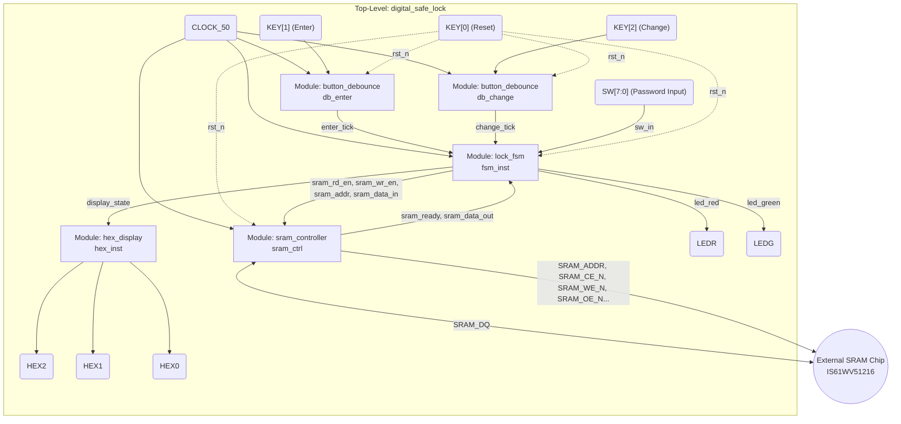

# System Architecture & Design Principles - Digital Safe Lock

This document outlines the hardware architecture of the digital safe lock system, explains the design choices, and details the verification strategy used to ensure its correctness.

## 1. System Block Diagram

---

## 2. Module Descriptions & Internal Operations

### 1. Top-Level Entity (`digital_safe_lock.v`)
- **Role:** Acts as the main wrapper, routing signals between internal sub-modules and physical I/O pins on the FPGA board (Switches, Buttons, LEDs, 7-Segment Displays, and SRAM pins).
- **Operation:** Besides structural wiring, it includes edge-detection logic for the debounced buttons. It generates a 1-clock-cycle `tick` pulse to notify the FSM exactly once per button press.

### 2. Button Debouncer (`button_debounce.v`)
- **Role:** Filters out mechanical contact bounce (noise) from physical push buttons `KEY[1]` and `KEY[2]`.
- **Operation:** Uses two flip-flops as a synchronizer to prevent metastability when reading asynchronous physical inputs. A 20-bit counter is utilized to wait for the button signal to remain completely stable for approximately 20ms (1,000,000 clock cycles at 50MHz) before passing the change to the output.

### 3. Central Control FSM (`lock_fsm.v`)
- **Role:** The "brain" of the system. A Finite State Machine (FSM) that dictates the current status of the lock (Idle, Unlocked, Error, Change Password) and coordinates operations.
- **Operation:**
  - **Boot-up:** Issues a command to write the default password (`00`) to the SRAM.
  - **Enter Press (`enter_tick`):** Instructs the `sram_controller` to read the stored password and compares it against the input switches (`SW`).
  - **Validation:** If matched -> Transitions to `UNLOCKED`, turns on the Green LED, and signals the display to show "OPN". If mismatched -> Transitions to `ERR`, turns on the Red LED for 2 seconds, then returns to Idle.
  - **Change Password (`change_tick`):** While unlocked, pressing "Change" reads the current value on `SW` and sends a Write command to the SRAM to update the password, displaying "CHG".

### 4. SRAM Controller (`sram_controller.v`)
- **Role:** Abstracts the complex physical timing requirements of the external asynchronous SRAM chip (IS61WV51216) into simple `rd_en` and `wr_en` signals for the FSM.
- **Operation:**
  - Operates as a micro-FSM with states: Idle, Read Cycle, and Write Cycle.
  - Manages active-low control signals (`CE_N`, `OE_N`, `WE_N`).
  - **Data Bus Safety:** Critically manages the bi-directional `SRAM_DQ` bus. It only drives the bus during a Write cycle. During Read cycles or Idle, it places the FPGA pins into a high-impedance state (`High-Z`) to allow the external SRAM chip to drive the bus without causing a short circuit.

### 5. 7-Segment Display (`hex_display.v`)
- **Role:** Translates simplified display state codes (`0, 1, 2, 3`) from the FSM into 7-segment control signals.
- **Operation:** Uses look-up logic to display corresponding messages:
  - State 0: "---" (Idle)
  - State 1: "OPn" (Opened)
  - State 2: "Err" (Error)
  - State 3: "Chg" (Changed)

---

## 3. Architecture & Design Rationale

Why was the system designed this way?

- **Modular Approach:** By separating the logic into discrete modules (Debouncer, FSM, SRAM Controller), the design is highly reusable. For example, if we switch to an EEPROM instead of SRAM, we only need to replace the `sram_controller.v` module; the FSM remains untouched.
- **Synchronous Design:** Everything runs off a single 50MHz clock. This prevents race conditions and makes timing analysis straightforward.
- **FSM-Centric Logic:** Security systems require strict, deterministic flow control (e.g., you cannot change the password unless you are already in the UNLOCKED state). An FSM is the most mathematically sound way to model this strict sequence of events.
- **Abstraction of Memory:** The FSM does not need to know about setup and hold times for SRAM read/writes. It just asserts an enable signal and waits for the controller to return a `ready` flag. This separation of concerns significantly simplifies debugging.

---

## 4. Verification Strategy & Testcases

To ensure the functionality of the design, we employ a self-checking testbench (`tb_digital_safe_lock.v`) that simulates various user scenarios. The testbench automatically compares the physical outputs (LEDs) against expected results.

Here are the primary testcases we run:

### [Test 1] Default Password Verification
- **Action:** Reset the system, input `00` via switches, and press Enter.
- **Expected Result:** System successfully reads SRAM, validates the default `00` password, turns on the Green LED, and transitions to Unlocked.

### [Test 2] Password Modification
- **Action:** While unlocked, change switch inputs to `A5` and press Change.
- **Expected Result:** The FSM sends a write command to the SRAM, saving `A5` as the new password. The display shows "CHG".

### [Test 3] Reject Invalid Access (Wrong Password)
- **Action:** Lock the safe. Input an incorrect password (e.g., `11`) and press Enter.
- **Expected Result:** System reads SRAM, validation fails. Turns on the Red LED, shows "Err" for 2 seconds, and remains locked.

### [Test 4] Unlock with New Password
- **Action:** Input the newly set password `A5` and press Enter.
- **Expected Result:** Validates successfully against the updated memory. Green LED turns on.

### [Test 5] Spamming Incorrect Passwords
- **Action:** Repeatedly enter multiple wrong passwords rapidly.
- **Expected Result:** FSM cleanly handles back-to-back errors without locking up or corrupting memory. The system should continuously reject the access with the Red LED.

### [Test 6] Subsequent Correct Access
- **Action:** After spamming wrong passwords, enter the correct password `A5` again.
- **Expected Result:** Validates successfully, proving that repeated error states do not permanently lock or break the FSM execution flow. Green LED turns on.

*(Note: The testbench utilizes `force` and `release` commands to bypass long human-scale timers, such as the 20ms debouncer and the 2-second display wait times, allowing the simulation to execute in milliseconds).*
